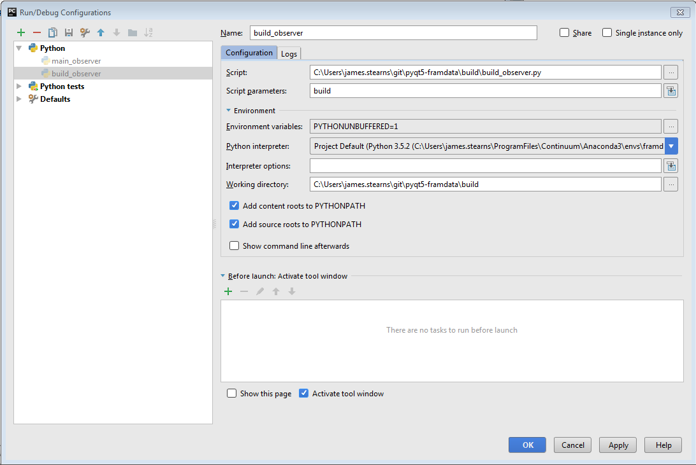

# How To Build OPTECS Installation Package

The OPTECS package - python files and initial observer database - 
is provided to users as a zip file.

## Overview of Process

1.  Run build_observer.py from PyCharm.
1.  Build_observer calls a packaging application, cx_freeze, is called to extract the
required files from the development tree and to build
a staging directory tree. The base of this tree is currently build/exe.win32-3.5.
1.  Build_observer then calls a zip progam to zip up the staging directory tree 
and place the zip file in the build/dist directory.
1.  A text change log is created and added to the base directory of the zip file.

## Pre-Requisites

An OPTECS developer environment on Windows 7 has been set up.
See [setting_up_dev_env](../doc/dev_env/setting_up_dev_env.md)
markdown document.

## Steps

1.  Activate the Conda environment set up during the build process.

1.  Pip installs:
    * pip install cx_Freeze
        * Extracts the required files from the dev tree and
        builds a directory tree to be zipped.
    * pip install click
        * An optparse package.
        
1.  Source Control: tag the release
    * Format of tag: Observer_YYYMMDD_build.
    * Alternative 1 (easiest): do using SourceTree.
    * Alternative 2: git command line:
    ```
    git tag -a Observer_YYYYMMDD_build -m 'a msg'
    ```
1.  Fire Up PyCharm
	* To avoid a bogus unresolved reference error for buildzipper, mark the build directory as a sources root
        * Designation as a sources root is not exclusive - other directories, namely its parent, can be marked as a sources root as well)
        * I.e., it's an easy way to include the build directory in the python path.
    *   Right-click build/build_observer.py and run.
    *   You'll get an error stating a required parameter was not specified.
    *   Edit the build_observer configuration, adding "build" to "Script parameters":
    
    *   Add the Create_observer_qrc external tool process to regenerate the QRC before running the build script
    *   Click the right arrow or right-click build_observer.py
    *   This creates a zip package in the build/dist directory.
    
1.  Create a Changelog Text File
    * Let's assume that one wants to include the changes since the
    previous package build - the previous build tag.
    * In this example commandline, the previous build was tagged
    with Observer_20161118_build and the new build is tagged
    with Observer_20161128_build:
    ```
    git log --oneline --author="Will Smith" --author "Jim Stearns" Observer_20161118_build..Observer_20161128_build > CHANGELOG_observer.txt
    ```
    
1.  Add the Changelog to the Zip File
    * Use Windows Explorer or a zip packager such as SecureZIP to add the file
    named CHANGELOG_observer.txt
    to the base observer directory.
    
1.  Test the Package
    * Unzip into a test directory.
    * From Windows Explorer, double-click on observer/observer.exe.
    The main OPTECS login window should come up.
    
