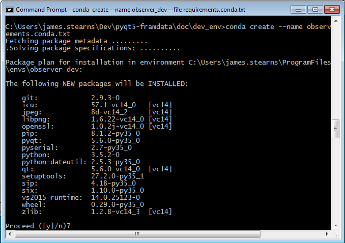

# Setting Up an OPTECS Development Environment Using Anaconda Python Distribution

## Overview

The purpose of this document to describe how to set up a software development environment for the Observer Program Technically-Enhanced Collection System ("OPTECS")
on Microsoft Windows using as the base package environment the Anaconda Python distribution from Continuum Analytics.

(There is another version using Python virtual environments and pip installs).

### Assumptions

* You do __not__ have system administrator privileges. Two implications:
    * You'll need a sys admin to install some applications,
    marked below in this section (and only in this section).
    * Wherever possible, installation will be done without requiring sys admin
    (i.e., installing for one user rather than system-wide).
* __[SysAdminRequired]__ Installed: Microsoft Windows 7 (although port to 10 should be straightforward).
* __[SysAdminRequired]__ Installed: PyCharm Community Edition (currently 2016.3).
* __[SysAdminRequired]__ Installed: SourceTree (GUI Front-end to git).
* __[SysAdminRequired]__ VisualStudio 2015 Community is installed (needed by Python package apsw - another python sqlite wrapper)
* Installed: Latest Python 3 version of Continuum Analytics Anaconda
(currently 4.2.9, using Python 3.5.2). Two notes:
    * __Please install for one user, not system-wide.__ (That's the default)
    * __Please install to a subdirectory that's not hidden and not read-only.__
        * The default one-user install directory on Windows is %USERPROFILE%/AppData,
        which is hidden and read-only by default. (In a later step, you won't be able to tell PyCharm
        where find the python interpreter within the Conda environment).
        * Suggested directory install path: %USERPROFILE%/ProgramFiles/Continuum/Anaconda3.
* Permission to access to NOAA GitLab source repository is established:
[Fram Data / pyqt5-framdata](https://nwcgit.nwfsc.noaa.gov/fram-data/pyqt5-framdata)

## Steps

### 1. Clone the repository using SourceTree

* Fire up SourceTree
* Click "Clone/New" in upper left. This brings up:


    * Source Path / URL: git@nwcgit.nwfsc.noaa.gov:fram-data/pyqt5-framdata.git
    * Destination Path: Your choice, but suggest base directory name should match repo name (e.g. pyqt5-framdata)_
_(I refer to this base directory below as \<baseProjDir>)_

* Give it a couple of minutes.
* Your resulting source tree should look something like this:


* In SourceTree, selecting the Branches view (choice in beige column to left)
should show the branch history similar to this one:


### 2. Create and activate a new Conda virtual environment with needed packages.

Create an Anaconda environment and populate with packages available from Anaconda:
```
cd <baseProjDir>\doc\dev_env
conda create --name observer_dev --file requirements.conda.txt
```
This will install the following packages:


### 3. Install Python Packages Available via Pip

Some needed packages aren't included in Anaconda. Most can be pip'd:
```
activate observer_dev
cd <baseProjDir>\doc\dev_env
pip install -r requirements.pip.txt
```

You will see a confirmation message like:
```
Successfully installed PyInstaller-3.2 future-0.15.2 peewee-2.8.5 pefile-2016.3.28 pypiwin32-219
```

You may also see messages from pip advising that a newer version of pip is available.
Please do __not__ update pip or any other packages - stick with the versions
specified in the requirements.{conda,pip}.txt files. 

Rationale: A goal of this installation process is
to keep all developers on the same versions of packages, and upgrade at the
same time, preferably in conjunction with a new version of Anaconda.

### 4. Install Un-pipable Packages.

The APSW package does not at present have a version
that is compatible with our dev environment. A compatible version
has been saved in the "source" (here, binary :-) tree. Use pip to 
install this package:
```
rem If conda environment not yet activated:
activate observer_dev 
cd <baseProjDir>\doc\dev_env\unpipable_packages
pip install apsw-3.12.2.post1-cp35-cp35m-win_amd64.whl 
```
### 5. Install the starter Observer SQLite Database.

The SQLite database for OPTECS, Observer.db,
contains some confidential information (names and captains of vessels)
and thus cannot be checked into our source control system.
Rather, this database has to be copied from a project file share, and renamed:
```
cd <baseProjDir>\data
copy Z:\Users\Todd.Hay\Observer\DB\clean_observer.db observer.db
```
_TODO: Rather than copying Observer.db,
create and populate a non-confidential test database with SQL scripts_

### 6. Establish Conda Virtual Env in PyCharm

* Fire up PyCharm and open your pyqt5-framdata project
* Tell PyCharm to use the python interpreter found in your Conda environment:
    * Settings, Project, Project Interpreter.
    * Select the gear icon to the right of project interpreter textbox.
    * Select "Add Local".
    * Navigate to python.exe inside the conda env.
    * The exact path depends upon where Anaconda was installed on your system.
    * For example, the path on my system was \Users\james.stearns\ProgramFiles\Continuum\Anaconda3\envs\observer_dev\python.exe.


### 7. Create External Tool in PyCharm for PyQt Tool pyrcc5

The QML of PyQt must be compiled before running a project inside PyCharm.
PyCharm must be told of this external tool.

* In PyCharm:
    * Settings, Tools, External Tools:
    * 
    * Click the "+" button just above the large white panel.
    This brings up the "Create Tool" window. Enter the following information:
        * Program: $PyInterpreterDirectory$\Library\bin\pyrcc5.exe
        * Parameters: qrc\observer.qrc -o py\observer\observer_qrc.py
    * 
    * Click "OK", which should bring you to:
    * 
    * Click "OK"
    
### 8. Define the main_observer Run Configuration in PyCharm

The file "main_observer.py" is the main program for observer.
It can be found in the base project directory - not in the py subdirectory.

* In the upper right of the PyCharm IDE, you'll see a green right arrow.
In the pull-down to its left, select "Edit Configurations".
You'll see a window like this:
* 
* In the "Before Launch" section, click the "+" button. This will bring up a small window
with a single pulldown, with a single choice:  "Run External Tool".
Select this item which will bring up:
* 
* Select "Create observer_qrc.py" and click OK twice.

### 9. Run the OPTECS Program in PyCharm.

Run main_observer and you should see:


