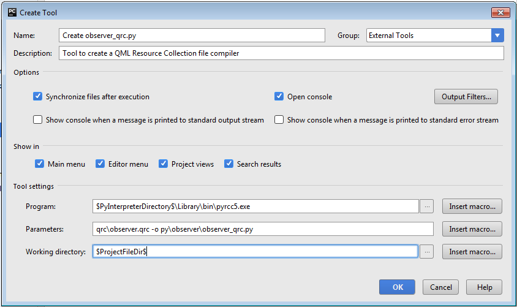
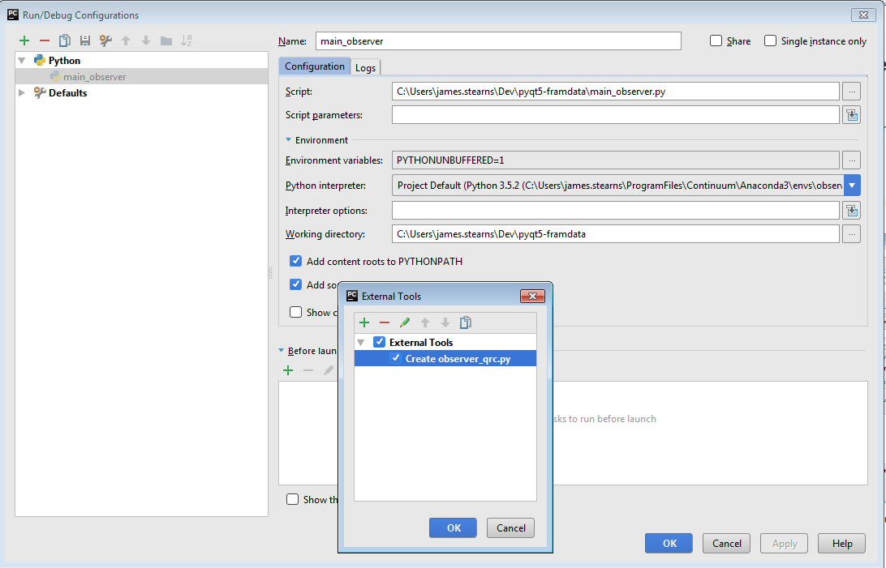

# Setting Up an OPTECS Development Environment

Using Python Virtual Environment, PyCharm and Pip

## Overview

The purpose of this document to describe how to set up a software development environment for the Observer Program Technically-Enhanced Collection System ("OPTECS")
on multiple operating systems using as the base package environment a Python virtual environment.

Windows is the primary operating system tbecause OPTECS tablets used by observers on vessels currently run Windows.
But OPTECS can run on Linux (except for DB sync upload - password manager not yet folded in) and on MacOS (same exception for DB sync).

These instructions are focused on installing on Windows.

### Assumptions

* You do __not__ have system administrator privileges. Two implications:
    * You'll need a sys admin to install some applications,
    marked below in this section (and only in this section).
    * Wherever possible, installation will be done without requiring sys admin
    (i.e., installing for one user rather than system-wide).
    
#### \[Windows] SysAdmin Prerequisites
* __\[SysAdminRequired]__ Installed: Microsoft Windows 7 64-bit (although port to 10 should be straightforward).
    * (If running Windows 7 in an Oracle VirtualBox VM, enable 2D and 3D acceleration in settings;
    without it, OPTECS will not start due to lacking an OpenGL driver)
* __\[SysAdminRequired]__ Installed: Git for Windows (current 2.14.1) (core.autocrlf=true)
* __\[SysAdminRequired]__ Installed: SourceTree (GUI Front-end to git).
* __\[SysAdminRequired]__ VisualStudio 2015 Community is installed (needed by Python package apsw - another python sqlite wrapper)
    * For access to VS2015 download, Microsoft requires membership (free) in Visual Studio Dev Essentials.
    * A copy of the VS2015 CE installer has been placed in the bin directory.
    * VS 2017 CE should work, but not yet tried.
* __\[SysAdminRequired]__ Installed: PyCharm Community Edition (currently 2017.2).

#### \[Linux] SysAdmin Prerequisites
* __\[SysAdminRequired]__ Installed: CentOS 7.3 with Developer Tools
* __\[SysAdminRequired]__ Installed: PyCharm Community Edition (currently 2017.2).

* Install
    * Download community edition (or professional, if you have license)
    * cd ~/Downloads
    * tar -xzf pycharm-community-2017.2.tar.gz
* Set Environment Variable To Avoid Input Hang
    * Add to .bash_profile:
    * export IBUS_ENABLE_SYNC_MODE="1"
    * Details of PyCharm defect (and out of date ibus on CentOS7):
    * https://youtrack.jetbrains.com/issue/IDEA-78860
* Fire up PyCharm
    * cd pycharm-community-2017.2
    * bin/pycharm.sh
    * Complained about 'IBus prior to 1.5.11 may cause input problems. See IDEA-78860 for details'
        * Fixed by IBUS_ENABLE_SYNC_MODE environment variable above.

#### \[Mac] SysAdmin Prerequisites

_(Reconstructing from memory - must have lost the draft with this section)_

* __\[SysAdminRequired]__ Installed: Xcode (for C compiler and git)
* __\[SysAdminRequired]__ Installed: SourceTree (GUI Front-end to git).
* __\[SysAdminRequired]__ Installed: PyCharm Community Edition (currently 2017.2).
* __\[SysAdminRequired]__ Installed: SSL certificates for Python

For python package apsw.

From [StackOverflow Post](https://stackoverflow.com/questions/41691327/ssl-sslerror-ssl-certificate-verify-failed-certificate-verify-failed-ssl-c):

Python 3.6 on MacOS uses an embedded version of OpenSSL, which does not use the system certificate store.
More details [here].

Symptoms: pip install command below fails with:
```
Error  <urlopen error [SSL: CERTIFICATE_VERIFY_FAILED] certificate verify failed
```

Fix:
```
sudo /Applications/Python 3.6/Install Certificates.command
```

#### \[Windows] Python Prerequisite (SA not required)
* Installed: Latest version of Python 3.6 (currently 3.6.2)
Notes:

    *   Install 64-bit version of Python (On Windows: currently python-3.6.2-amd64.exe)
    *   Install to visible directory, not AppData.
        * Such as ~/Programs/Python/Python36
    * __Please install for one user, not system-wide.__ (That's the default)
    * Check "Add python to PATH" (so it shows up in %PATH%)
    
#### \[Linux] Python Prerequisite (SA required)

* __\[SysAdminRequired]__ Installed: python 3.6.2 and virtualenv
* Install pre-requisites for building python 3.6
    * sudo yum install zlib-devel # To build pip
    * sudo yum install openssl-devel # So pip can access locations with SSL
    * sudo yum install sqlite-devel # To access sqlite db's
    (see [sqlite3 missing after python 3 build](https://stackoverflow.com/questions/18750886/missing-sqlite3-after-python3-compile)

* Extract python source and configure
    * cd ~/Downloads
    * wget http://python.org/ftp/python/3.6.2/Python-3.6.2.tar.xz
    * tar xf Python-3.6.2.tar.xz
    * cd Python-3-6.2
    * ./configure --prefix=/usr/local
    * make
    * sudo make altinstall
    * Test: /usr/local/bin/python3.6
    * export PATH="/usr/local/bin:$PATH"

* pip
    * pip is already done: pip3.6 is installed as part of python installation (so is setuptools)
    * virtualenv: DON'T INSTALL VIRTUALENV. USE python -m venv INSTEAD.
        
## Steps To Install and Configure OPTECS

### 1.A Clone the repository using command line git

On Windows, use a git bash window.

```bash 
cd 
mkdir FramDataRepos  # or wherever you base your repos
git clone git@nwcgit.nwfsc.noaa.gov:fram-data/pyqt5-framdata.git pyqt5-framdata
```

### 1.B \[Windows, Mac] Configure Point SourceTree at already existing local repository

* Need to load ssh private key:
    * (Assuming ssh key already created with ssh-keygen)
    * SourceTree: Tools/Create or Import SSH keys. Brings up PuTTY Key Generator
    * Import .ssh/id_rsa key created above
    * Create a putty private key file (.ppk), save in same ~/.ssh dir as private ssh key.

    * Tools/Options
        * Use global config values (git user.name, user.email)
        * Configure Client SSH Configuration: load in the private ssh key in PuTTY format:

* Add local git repo at location to which you git clone'd.
* In SourceTree, selecting the Branches view (choice in beige column to left)
should show the branch history similar to this one:


### 2. Specify a new Python virtual environment in PyCharm

Will found a gotcha with cx_freeze build tool and PyCharm's use of virtualenv
to create a virtual environment. Besides, with Python 3.6 using python -m venv
is recommended over virtualenv or pyvenv. See
[Creating virtual environments](https://docs.python.org/3/library/venv.html).


#### 2A. Create a virtual environment outside PyCharm

```
cd pyqt5-framdata/virtualenv
python3 -m venv jim_py362  # Substitute your directory name for 'jim_py362'
```

#### 2B. Reference the already existing local virtual environment in PyCharm.
* Fire up PyCharm and open a project at the GitLab just cloned.
* In Settings, reference that Python3 interpreter in the Python virtual environment just created.
* The convention suggested by Will Smith is to place in the source
tree, in the virtualenv subdirectory, which is mostly .gitignored.


### 3. Update Pip

A gotcha discovered by and workaround developed by Will Smith.

```
cd <baseProjDir>\virtualenv\<YourVirtualEnv>
Scripts/activate # or on Mac/Linux: source bin/activate
easy_install -U pip
```

You will see a confirmation message like:
```
pip 9.0.1 is already the active version in easy-install.pth
Installing pip script to /home/jsnoaa/FramDataRepos/pyqt5-framdata/virtualenv/jim_py362/bin
Installing pip3 script to /home/jsnoaa/FramDataRepos/pyqt5-framdata/virtualenv/jim_py362/bin
Installing pip3.6 script to /home/jsnoaa/FramDataRepos/pyqt5-framdata/virtualenv/jim_py362/bin
```

### 4.\[Windows] Copy master requirements.txt to newly created virtual env

```
cd <baseProjDir>\virtualenv\<YourVirtualEnv>
# Copy the master requirements file for virtualenv's that are using python 3.6.2:
copy ../optecs-python36/requirements.txt requirements.master.txt
# Keep the "master" requirements for comparing to pip freeze output after pip install of local apsw wheel.
```

### 4.\[Linux, MacOS] Copy master requirements, less Windows-specific packages, to newly created virtual env

``` 
cd <baseProjDir>/virtualenv/<YourVirtualEnv>
# Copy the master requirements file for virtualenv's that are using python 3.6.2:
cp ../optecs-python36/requirements.txt requirements.master.txt
# Keep the "master" requirements for comparing to pip freeze output after pip install of local apsw wheel.
```

To assist with SOAP DB sync operations on Windows, OPTECS on Windows imports a package of Windows types, pywin32-ctypes.

The presence of this Windows-specific package on Linux leads the keyring to conclude that the Windows Certificate Vault is available. When that conclusion is dashed, OPTECS throws a type-not-supported exception.

``` 
vim requirements.master.txt
# Remove the lines for pywin32-ctypes, pypiwin32, and if present, winsound.
# Save the file.
```

### 5. Install Python Packages Available via Pip

#### 5.A Comment out packages in your requirements that aren't available remotely
```
copy (or [Linux] cp) requirements.master.txt requirements.remote.txt
cd <baseProjDir>\virtualenv\<YourVirtualEnv>
Scripts/activate or [Linux] source bin/activate
vim requirements.remote.txt
REM Comment out (prefix with '#') apsw (will be installed in later step). 
REM Save 
```

#### 5.B Pip install Remote Packages

```
cd <baseProjDir>\virtualenv\<YourVirtualEnv>
Scripts/activate or [Linux] source/bin/activate 
pip install -r requirements.remote.txt
```

You will see a confirmation message like:
```
Successfully installed PyQt5-5.9 appdirs-1.4.0 arrow-0.10.0 asn1crypto-0.22.0 cached-property-1.3.0 cffi-1.10.0 click-6.7 cryptography-2.0.2 cx-Freeze-5.0.1 defusedxml-0.4.1 idna-2.5 isodate-0.5.4 keyring-10.2 lxml-3.8.0 mypy-0.521 peewee-2.8.5 pycparser-2.18 python-dateutil-2.6.0 pytz-2016.10 pywin32-ctypes-0.0.1 requests-2.13.0 requests-toolbelt-0.7.0 secretstorage-2.3.1 sip-4.19.3 six-1.10.0 sqlparse-0.2.3 typed-ast-1.0.4 typing-3.5.3.0 zeep-0.27.0
```

#### 5.C Install Python wheel(s) into virtual environment

The APSW package does not at present have a remote repository wheel version
that is compatible with our dev environment.

##### \[Windows] Apsw
A compatible version
has been saved in the "source" (here, binary :-) tree. Use pip to 
install this package:
```
cd <baseProjDir>\virtualenv\<YourVirtualEnv>
Scripts/activate
pip install <baseProjDir>\bin\SQLlite Encryption Extension\apsw-3.20.1.post1-cp36-none-win_amd64.whl
```
__TODO Move whl to bin/ directory__  
__TODO Move unpipable packages dir to virtualenv directory__  
__TODO Use Miniconda environment as base so yml file can conda, pip and unpip install__

##### \[Linux, MacOS] Apsw

__Do NOT do this: pip install apsw. It installs a non-Binns version 3.9.2.post1__

##### Pre-requisite: SSL certificates installed for Python (see above)

##### \[Linux, MacOS] Apsw

From [Roger Binns' APSW GitHub Page](https://rogerbinns.github.io/apsw/download.html):
_For those developers who really want to use pip
The following pip command line downloads APSW from github, SQLite from the official site, and builds/installs with all extensions enabled._

_Use this (all one command):_

``` 
pip install --user https://github.com/rogerbinns/apsw/releases/download/3.20.1-r1/apsw-3.20.1-r1.zip \
--global-option=fetch --global-option=--version --global-option=3.20.1 --global-option=--all \
--global-option=build --global-option=--enable-all-extensions

pip install --user https://github.com/rogerbinns/apsw/releases/download/3.20.1-r1/apsw-3.20.1-r1.zip  --global-option=fetch --global-option=--version --global-option=3.20.1 --global-option=--all  --global-option=build --global-option=--enable-all-extensions 
```

Running this command worked! But make sure you're downloading the latest version of apsw:
replace apsw-3.20.1-r1 below with the version shown at
[Roger Binns's GitHub Site](https://rogerbinns.github.io/apsw/download.html).

``` 
cd <baseProjDir>/virtualenv/<YourVirtualEnv>
source bin/activate

pip install --user https://github.com/rogerbinns/apsw/releases/download/3.20.1-r1/apsw-3.20.1-r1.zip \
--global-option=fetch --global-option=--version --global-option=3.20.1 --global-option=--all \
--global-option=build --global-option=--enable-all-extensions
/Users/james.stearns/Documents/FramDataRepos/pyqt5-framdata/virtualenv/jim_py362/lib/python3.6/site-packages/pip/commands/install.py:194: UserWarning: Disabling all use of wheels due to the use of --build-options / --global-options / --install-options.
  cmdoptions.check_install_build_global(options)
Collecting https://github.com/rogerbinns/apsw/releases/download/3.20.1-r1/apsw-3.20.1-r1.zip
  Downloading https://github.com/rogerbinns/apsw/releases/download/3.20.1-r1/apsw-3.20.1-r1.zip (680kB)
    100% |████████████████████████████████| 686kB 766kB/s 
Installing collected packages: apsw
  Running setup.py install for apsw ... done
Successfully installed apsw-3.20.1.post1
```

Worked, but installed in the wrong location, outside of the virtual environment:

```
# On Linux:
ll ~/.local
apsw_package_root=~/.local/lib/python3.6/site-packages
# MacOS:
ll ~/Library
apsw_package_root=~/Library/Python/3.6/lib/python/site-packages
# (Your path may vary. Here's an example:)
venv_site_package_root=~/FramDataRepos/pyqt5-framdata/virtualenv/jim_py362    
```

Kludge fix: copy from ${apsw_package_root} into virtualenv's site-packages:
``` 
cd ${apsw_package_root}
cp -R apsw* ${venv_site_package_root}/lib/python3.6/site-packages
```

And apsw now shows as installed in the virtual env:
``` 
(jim_py362) [jsnoaa@CentOS-JS206 site-packages]$ pip freeze
appdirs==1.4.0
apsw==3.20.post1
...
```

#### 5.E \[MacOS] Install Unicode Library Needed by apsw

__Installation is into the MacOS host environment, so need be done only once__
__(Not once per virtual environment)__

Background: apsw requires a particular version of a unicode library that is not installed by default
on MacOS. Its absence is noted when trying to run main_observer:
```
ImportError: dlopen(/Users/james.stearns/Documents/FramDataRepos/pyqt5-framdata/virtualenv/jim_py362/lib/python3.6/site-packages/apsw.cpython-36m-darwin.so, 2): Library not loaded: libicui18n.54.dylib
  Referenced from: /Users/james.stearns/Documents/FramDataRepos/pyqt5-framdata/virtualenv/jim_py362/lib/python3.6/site-packages/apsw.cpython-36m-darwin.so
  Reason: image not found
```

The following steps install the needed library. One additional step of specifying the library location
is done below, in PyCharm. Steps to install on MacOS:

1. Download the HomeBrew bottle from https://downloads.sf.net/project/machomebrew/Bottles/icu4c-54.1.mavericks.bottle.1.tar.gz
2. Unpack and copy to the bottle directory for HomeBrew:
```
cd ~/Downloads
mkdir tmp_unpack
tar -xvzf  icu4c-54.1.mavericks.bottle.1.tar.gz -C tmp_unpack
cd tmp_unpack/icu4c
ls  # Should show 54.1 as only subdirectory
cp 54.1 /usr/local/Cellar/icu4c/
```
1. Tell HomeBrew to set up version 54 as the default uic4c library
```
brew switch icu4c 54.1
```

#### 5.F Compare Installed Package List vs Requirements List

Compare requirements.master.txt to `pip freeze` output. Should be the same - package list and version level.
__MacOS__: one more package may have been installed: _certifi_ (from Mac-only Install command above)

#### 5.G  \[Linux Only] Install DB Sync Credentials Library and Tool

__NOT YET IMPLEMENTED. DB SYNC MAY NOT BE NEEDED ON LINUX__

Issue: keyring package has only been used on Windows with the Windows Credentials value. It isn't yet working on Linux.

Discussion (i.e. breadcrumbs for implementation on Linux)
* References
    * [Keyring](https://pypi.python.org/pypi/keyring#linux)
    * Dependency of Keyring on Linux: [SecretStorage](https://github.com/mitya57/secretstorage)
* Install keyring package to virtualenv. 
    * Pre-requisite: yum-install (not pip) of dbus-python (see references above for source of this required package and required installation method).
    * Sudo required.
	* Make sure it can find and use the Linux equivalent of the Windows Vault: Freedesktop Secret Service
	* Use a toy program to set the keyring, add a password, and extract the password.
	* Look at Will's standalone program to add a password: set_optecs_sync_pw.py (not in repo; zip file in Z:\Users\Todd.Hay\Observer) and build/build_observer_keyinstaller.py
	* (Keyring jeepney)[https://pypi.python.org/pypi/keyring_jeepney] looks promising. It refers to the installation difficulties of secret service. 

### 6. Install the starter Observer SQLite Database.

The SQLite database for OPTECS, Observer.db,
contains some confidential information (names and captains of vessels)
and thus cannot be checked into our source control system.

_TODO: Rather than copying Observer.db,
create and populate a non-confidential test database with SQL scripts_

####  \[Windows] Observer.db

Rather, this database has to be copied from a project file share, and renamed:
```
cd <baseProjDir>\data
copy Z:\Users\Todd.Hay\Observer\DB\clean_observer_IFQDEV.db observer.db
```

####  \[Linux, MacOS] Observer.db

_This needs to be formalized. For time being, copy from my Windows laptop PC:_

``` 
# From Windows
cd <baseProjDir\data\GoodDBs
scp clean_observer_IFQADMIN.db jsnoaa@192.168.56.101:/home/jsnoaa/FramDataRepos/pyqt5-framdata/data/GoodDBs
scp clean_observer_IFQDEV.db jsnoaa@192.168.56.101:/home/jsnoaa/FramDataRepos/pyqt5-framdata/data/GoodDBs
```
And on CentOS7 or MacOS system:

```bash
cd <baseProjDir/data/GoodDBs
# Devs will typically use IFQDEV, but IFQADMIN is also a possibility. Use dev here:
cp clean_observer_IFQDEV.db ../observer.db
```

### 7. Create External Tool in PyCharm for PyQt Tool pyrcc5

The QML of PyQt must be compiled before running a project inside PyCharm.
PyCharm must be told of this external tool.

* In PyCharm:
    * Settings (or Preferences on MacOS), Tools, External Tools:
    * 
    * Click the "+" button just above (or below, on the Mac) the large white panel.
    This brings up the "Create Tool" window. Enter the following information:
        * Program on Windows: __$PyInterpreterDirectory$\pyrcc5.exe__ (Note: screenshot contains incorrect path. Use this!)
        * Program on Linux: __$PyInterpreterDirectory$/pyrcc5__ (Note: screenshot contains incorrect path. Use this!)
        * Parameters on Windows: qrc\observer.qrc -o py\observer\observer_qrc.py
        * Parameters on Linux: qrc/observer.qrc -o py/observer/observer_qrc.py
        * Working Directory: $ProjectFileDir$
    * 
    * Click "OK", which should bring you to:
    * 
    * Click "OK"

* $PyInterpreterDirectory$ points to the PROJECT DEFAULT interpreter path, not the currently selected venv.
  * File - Settings - Project - pyQtFramData - Project Interpreter - set to your venv

### 8. Define the main_observer Run Configuration in PyCharm

The file "main_observer.py" is the main program for observer.
It can be found in the base project directory - not in the py subdirectory.

* In the upper right of the PyCharm IDE, you'll see a green right arrow.
In the pull-down to its left, select "Edit Configurations".
You'll see a window like this:
* 
* In the "Before Launch" section, click the "+" button. This will bring up a small window
with a single pulldown, with a single choice:  "Run External Tool".
Select this item which will bring up:
* 
* Select "Create observer_qrc.py" and click OK twice.

#### 8.A \[MacOS] Add path for unicode dynamic library

DYLD_LIBRARY_PATH=/usr/local/Cellar/icu4c/54.1/lib


### 9. Run the OPTECS Program in PyCharm.

Run main_observer and you should see:


### 10. Set up OPTECS Program for Database Sync'ing

* Code-patch a Zeep python file
    * See comment in py/observer/ObserverSOAP.py for latest location (may change with Zeep version)
    * Current patch:
        * Path: pyqt5-framdata/virtualenv/<yourVirtualEnv>/lib/python3.6/site-packages/zeep/xsd
        * File: schema.py
        * Patch line 372 for Zeep Version 0.27.0, add the following after try:
    ```
    def _get_instance(self, qname, items, item_name):
        try:
            if qname.localname == 'arrayList':
                return self._types['{http://www.oracle.com/webservices/internal/literal}list']
            else:
                return items[qname]
    
    ```
* Obtain access to target database
    * Current WSDL address, for IFQDEV, can be found in observer.db SETTINGS table.

    * First thing for DB Sync to work is a login to the IFQDEV database
    (I believe I emailed the DBA's directly, nmfs.nwfsc.dba@noaa.gov,
    and CC'd Todd to validate the appropriate permissions for that)
    
    * Then a login to the Observer Dev website (Neil Riley set that up, after I had IFQDEV DB access.)
    
* Set up link to At-Center IFQDEV

    * RUN_ME_INSTALL_KEYS.bat. Obtain from shared FRAM drive
    Users/Todd.Hay/Observer/observer_keyinstaller_YYYYMMDD.zip. Not in source control.
    
* Log into OPTECS with credentials from Observer Test website
    * N.B. Do not use credentials to access IFQDEV, but rather credentials to access via web
    (through which the DB Sync is performed.)
    * User name is typically <firstName><lastName>
